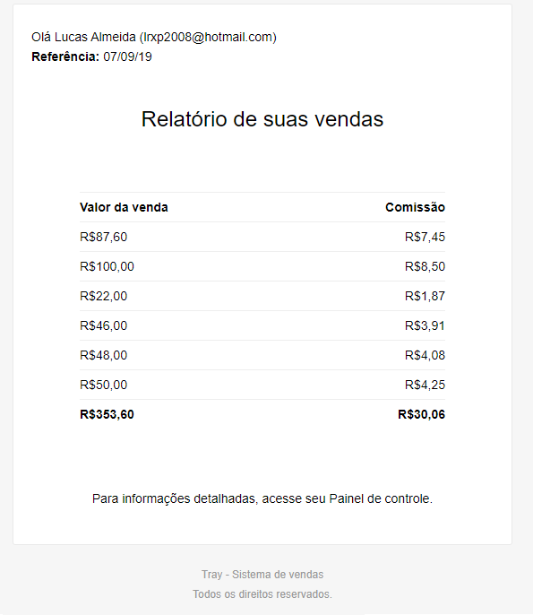

# Laravel API - Vendedores

Essa API foi desenvolvida utilizando o Framework Laravel. Seu propósito é para cadastro de vendedores e vendas, com cálculo de comissões e disparo de relatório no final do dia.  
  
## Visão geral

API para cadastro de vendedores e cálculo de comissão. Disparo de e-mail para os vendedores cadastrados, com resumo consolidado das vendas diárias.

### Pré-requisitos

Caso você não utilize o Homestead, é necessário os seguintes requisitos para utilização dessa API:

- PHP >= 7.2.0
- BCMath PHP Extension
- Ctype PHP Extension
- JSON PHP Extension
- Mbstring PHP Extension
- OpenSSL PHP Extension
- PDO PHP Extension
- Tokenizer PHP Extension
- XML PHP Extension

```
É altamente recomendado a utilização do Homestead para uso local.
```

### Configurando permissões de diretório

Após clonar esse projeto, você precisará configurar algumas permissões. Diretórios como o "storage" e "bootstrap/cache" precisam de permissão de escrita (755) ou o Laravel não irá funcionar. Caso você esteja utilizando o Homestead, essas permissões são configuradas automaticamente.

```
chmod -R 755 storage
chmod -R 755 bootstrap/cache
```

### Configurando a Application Key

Se você instalou o Laravel utilizando o Composer ou a instalação do Laravel, a chave foi configurada automaticamente. Se precisar gerar uma nova chave, utilize o seguinte comando:

```
php artisan key:generate

Se você não configurar a Application Key, sessão e outros dados de usuários não estarão seguros!
```

## Configurando o Banco de Dados

Abra o arquivo ".env" e altere as seguintes informações:

```
DB_CONNECTION=mysql  
DB_HOST=Endereço do Banco  
DB_PORT=3306  
DB_DATABASE=Nome do Banco  
DB_USERNAME=Usuário  
DB_PASSWORD=Senha  
```

### Configurando o disparo de E-mails

```
MAIL_DRIVER=smtp  
MAIL_HOST=Endereço SMTP  
MAIL_PORT=2525  
MAIL_USERNAME=Usuário  
MAIL_PASSWORD=Senha  
MAIL_ENCRYPTION=null  

É recomendado o MailTrap.io para testes locais.
```

## Configurando o envio do relatório diário  
  
```
Acesse \app\Kernel.php  
- Na linha "->dailyAt('18:00')", altere 18:00 para o horário que desejar.  
  
Não se esqueça de rodar o comando "php artisan relatorioDiario:cron".
```  

## Configurações adicionais

Após configurar o arquivo .ENV, é necessário executar os seguintes comandos:

```
php artisan cache:clear
php artisan migrate
```

## Deploy

Para utilização do Homestead, utilize:

```
vagrant up
```

## Serviços disponíveis  
  
Rotas dos serviços disponíveis:  
  
```
[GET] /api/vendedores  
- Listar todos os Vendedores  
  
[POST] /api/vendedores/cadastrar  
- Criar Vendedor  
- Parâmetros de entrada: nome, email  

[POST] /api/vendedores/remover 
- Excluir Vendedor  
- Parâmetros de entrada: id

[GET] /api/vendas  
- Listar todas as vendas  
  
[GET] /api/vendas/{vendedor_id}  
- Listar todas as vendas de um vendedor 

[POST] /api/vendas/lancar  
- Lançar nova Venda  
- Parâmetros de entrada: vendedor_id, valor

[POST] /api/vendas/remover 
- Excluir uma venda  
- Parâmetros de entrada: id

```

## Autores

Lucas Ronaldo de Almeida  
  
## Screenshots  
  


## License

This project is licensed under the MIT License - see the [LICENSE.md](LICENSE.md) file for details
